# fastretro-cli

A terminal tool for sprint retrospectives and team health checks. Manage teams, track action items, run sessions locally, or join remote [fastRetro](https://github.com/helmedeiros/fastRetro) sessions — all without leaving your terminal.

Built with [Bubble Tea](https://github.com/charmbracelet/bubbletea) and [Lip Gloss](https://github.com/charmbracelet/lipgloss).

## Quick start

```bash
brew install helmedeiros/tap/fastretro
fastretro
```

Or with Go:

```bash
go install github.com/helmedeiros/fastretro-cli/cmd/fastretro@latest
```

## What it does

**Two session types, one workflow:**

| | Retrospective | Check |
|---|---|---|
| **Purpose** | Reflect on a sprint | Measure team health |
| **Input** | Cards in columns | Rate questions 1-N |
| **Templates** | Start/Stop, Mad Sad Glad, KALM, Four Ls, Starfish, Anchors & Engines | Health Check (9 Qs), DORA Metrics Quiz (5 Qs) |
| **Stages** | Icebreaker → Brainstorm → Group → Vote → Discuss → Review → Close | Icebreaker → Survey → Discuss → Review → Close |
| **Discuss** | Cards ordered by votes | Questions ordered by median (worst first) |
| **Output** | Action items + board overview | Action items + score comparison |

Both produce **action items with owners** that persist on your team dashboard.

## Home screen

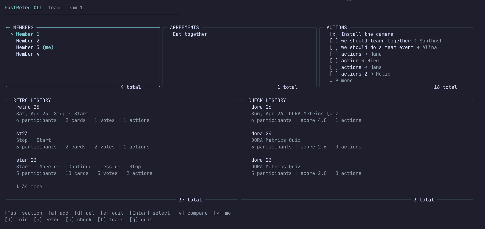

Members, agreements, action items, and session history — all in titled panels. Retro and check history are separate, with scores and stats.

## Running a check

Press `c` from home → pick a template → name it → go.

<details>
<summary>See the full check flow</summary>

### 1. Pick a template

Each template shows its questions with descriptions and option scales.

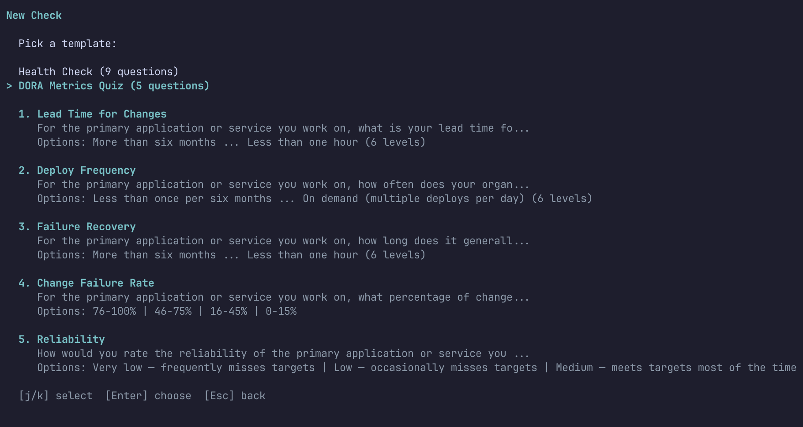

### 2. Name your check

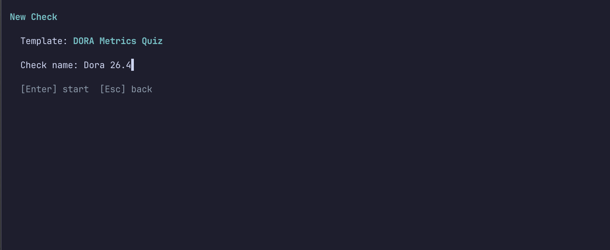

### 3. Icebreaker

Same warm-up as retros — spin questions for each participant.

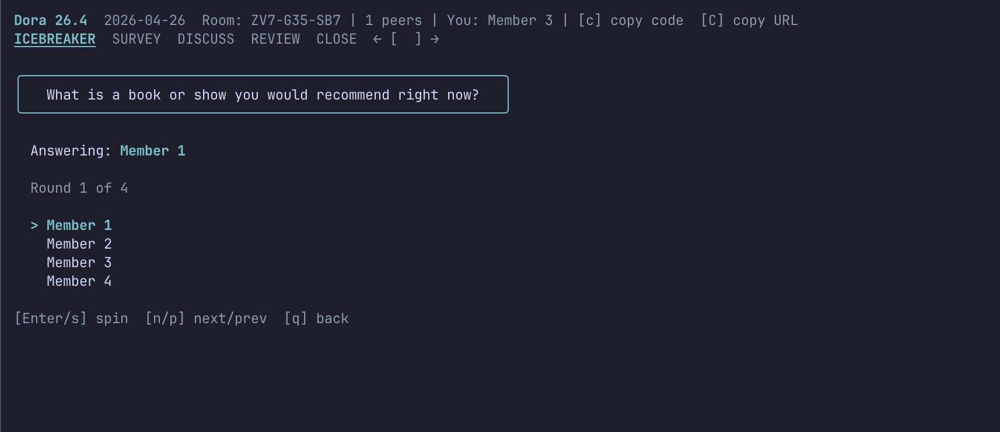

### 4. Survey

Rate each question with number keys. Add comments with `e`.

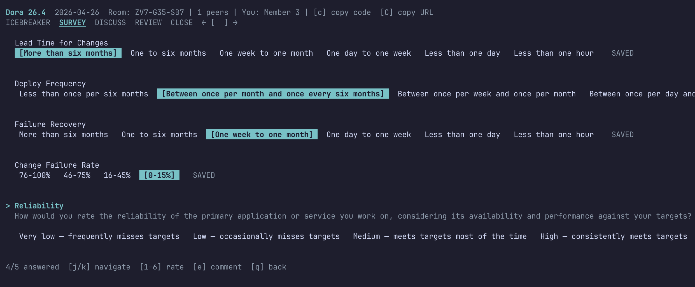

### 5. Discuss

Questions carousel ordered by median score (worst first). Add action items.

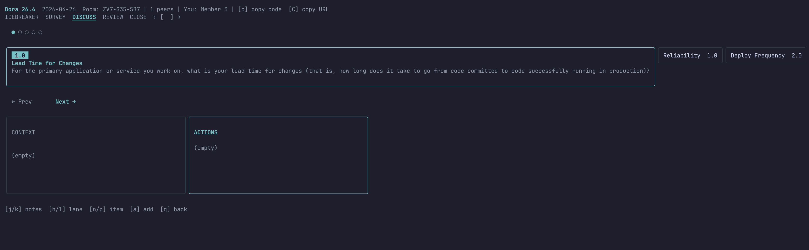

### 6. Review

Assign owners to action items.

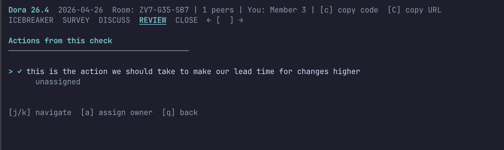

### 7. Close

Summary with stats, action items, and survey results.

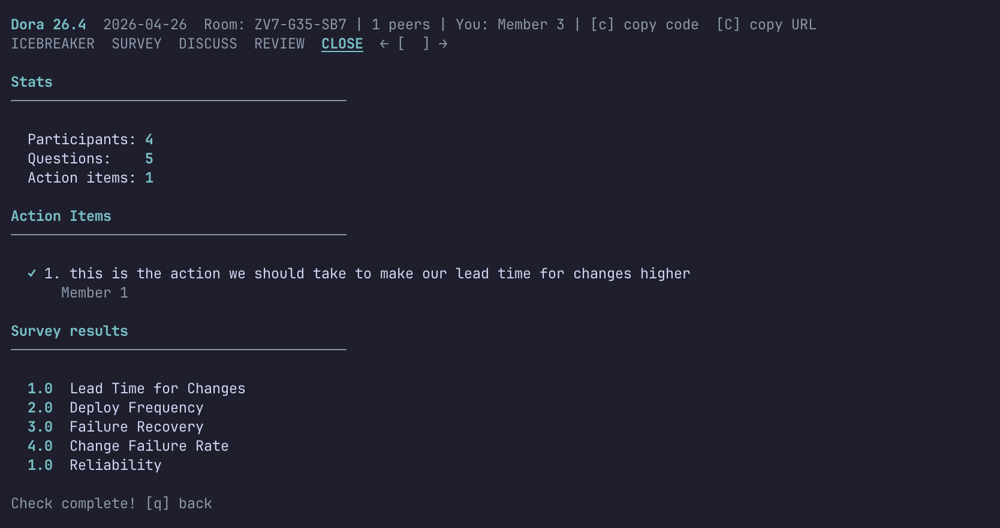

</details>

## Running a retro

Press `n` from home → pick a template → name it → go.

<details>
<summary>See the full retro flow</summary>

### 1. Pick a template

Six facilitation designs with column descriptions.

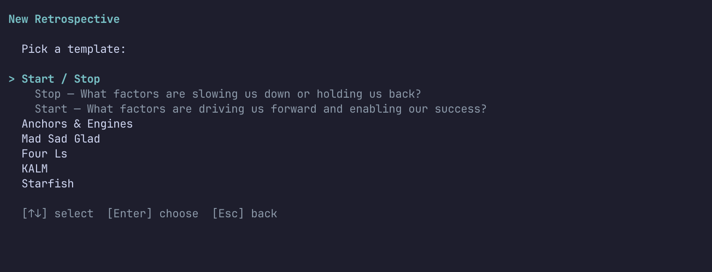

### 2. Icebreaker

Spin random questions for each participant.


### 3. Brainstorm

Add cards to template columns. `a` to add, `d` to delete.


### 4. Group

Merge related cards with `m` (two-step). Rename with `e`.


### 5. Vote

Cast votes within your budget. `Enter` to vote, `u` to unvote.


### 6. Discuss

Carousel of items ordered by votes. Context + Actions lanes.


### 7. Review & Close

Assign action item owners, then view the summary.

</details>

## Check comparison

Press `v` from home to compare scores across check sessions.

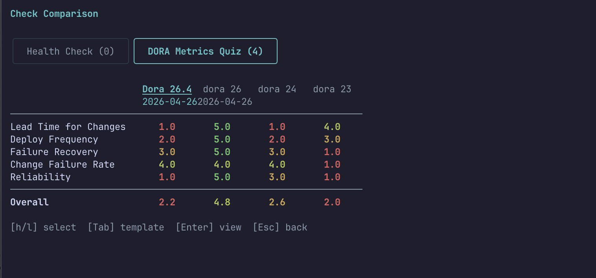

Tab between templates. Scores are color-coded: green (high), red (low). Press Enter on a column to view that session.

## Joining a remote session

Press `J` from home, paste the room code or URL. Changes sync in real time via WebSocket.

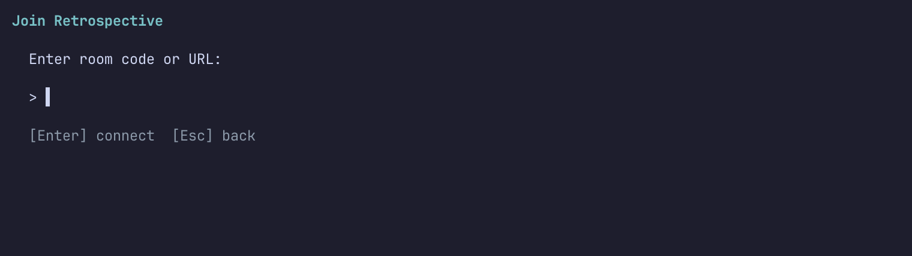

## Team management

Press `t` to manage teams. Each team has its own members, agreements, action items, and history stored in `~/.fastretro/`.

```bash
fastretro team list
fastretro team create "My Team"
fastretro team select "My Team"
```

## Keyboard shortcuts

Consistent vim-style keys across all screens:

| Key | Action |
|-----|--------|
| `j`/`k` | Navigate up/down |
| `h`/`l` | Navigate left/right |
| `Tab` | Cycle sections/panels |
| `Enter` | Confirm/select |
| `a` | Add/create/assign |
| `d` | Delete |
| `e` | Edit/rename/comment |
| `n`/`p` | Next/prev (carousels) |
| `[`/`]` | Prev/next stage |
| `Esc` | Cancel/back |
| `q` | Back/quit |

## Development

```bash
make build      # Build binary to ./bin/fastretro
make test       # Run all tests
make check      # Full quality gate: fmt + lint + test-race + build
make cover      # Coverage report
```

### Project structure

```
cmd/fastretro/        CLI entry point (cobra)
internal/
  domain/             Team, history, registry (pure functions)
  storage/            JSON file persistence (~/.fastretro/)
  protocol/           WebSocket messages + templates
  client/             WebSocket connection manager
  tui/                Bubble Tea views (home, shell, stages)
  widgets/            Reusable TUI components (box, scroll, columns, median, wrap)
  styles/             Lip Gloss theme
```

### Quality gates

- **golangci-lint**: 12 linters (errcheck, staticcheck, govet, unused, gosimple, misspell, revive, gofmt, goimports, ineffassign, typecheck)
- **Race detection**: All tests run with `-race`
- **CI**: GitHub Actions on every push/PR to main

## Requirements

- Go 1.21+
- A running [fastRetro](https://github.com/helmedeiros/fastRetro) instance (for remote sessions)

## License

MIT
