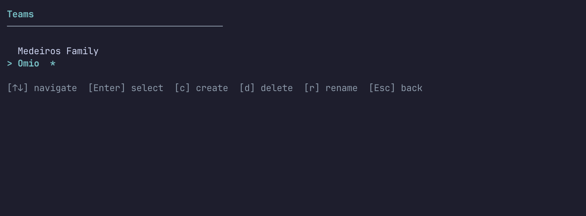
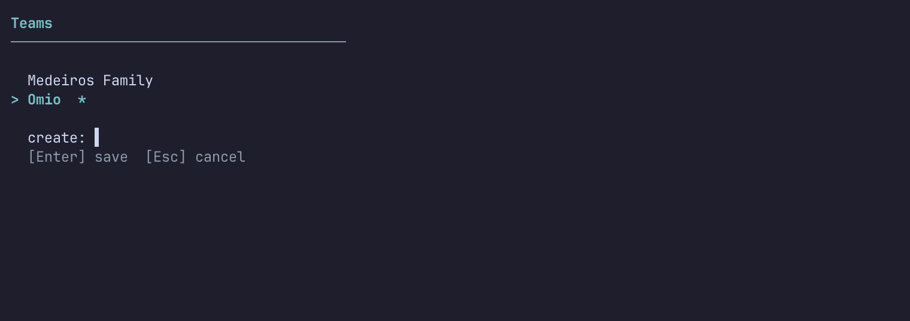

# fastretro-cli

A standalone terminal tool for sprint retrospectives and team health checks. Manage teams, track action items, run retros and checks locally, or join remote [fastRetro](https://github.com/helmedeiros/fastRetro) sessions — all without leaving your terminal.

Built with [Bubble Tea](https://github.com/charmbracelet/bubbletea) and [Lip Gloss](https://github.com/charmbracelet/lipgloss).

## Quick start

```bash
go install github.com/helmedeiros/fastretro-cli/cmd/fastretro@latest

# Launch the dashboard
fastretro

# Or join a remote session directly
fastretro join "http://localhost:5173/#room=ABC-123-DEF"
```

Or build from source:

```bash
git clone https://github.com/helmedeiros/fastretro-cli.git
cd fastretro-cli
make build
./bin/fastretro
```

## Home Screen

Running `fastretro` with no arguments launches the team dashboard.


| Key       | Action                        |
|-----------|-------------------------------|
| `Tab`     | Cycle between panels          |
| `j` / `k` | Navigate within panel         |
| `a`       | Add item (member/agreement/action) |
| `d`       | Delete selected item          |
| `e`       | Edit selected item            |
| `Enter`   | Toggle action done / View history |
| `v`       | Compare checks (score matrix) |
| `*`       | Set default member (me)       |
| `J`       | Join a remote session         |
| `n`       | Start a new local retro       |
| `c`       | Start a new check             |
| `t`       | Open team selector            |
| `q`       | Quit                          |

## Team Management

Press `t` from the home screen to manage teams. Create new teams, switch between them, rename, or delete.





| Key       | Action          |
|-----------|-----------------|
| `j` / `k` | Navigate teams  |
| `Enter`   | Select team     |
| `a`       | Create new team |
| `e`       | Rename team     |
| `d`       | Delete team     |
| `Esc`     | Back to home    |

Or use CLI commands:

```bash
fastretro team list
fastretro team create "Backend Crew"
fastretro team select "Backend Crew"
fastretro team delete "Old Team"
```

Each team has its own members, agreements, action items, and retro history stored locally in `~/.fastretro/`.

## Retro Stages

Every session follows a stage flow. The stage bar at the top always shows where you are:

**Retrospective:** `ICEBREAKER  BRAINSTORM  GROUP  VOTE  DISCUSS  REVIEW  CLOSE`

**Check:** `ICEBREAKER  SURVEY  DISCUSS  REVIEW  CLOSE`

---

### Join

Pick your identity from the participant list or add a new name.


| Key       | Action                |
|-----------|-----------------------|
| `j` / `k` | Navigate participants |
| `Enter`   | Select identity       |
| `a`       | Add new name          |
| `q`       | Back                  |

---

### Icebreaker

Watch the icebreaker question and see who's answering. Controlled from the web app.


---

### Brainstorm

Add cards to columns. Navigate between columns with `Tab`. Each column shows its template description so everyone knows what to write about.


| Key              | Action            |
|------------------|-------------------|
| `j` / `k`        | Navigate cards    |
| `Tab` / `l` / `h` | Switch column    |
| `a`              | Add card          |
| `d`              | Delete your card  |
| `Enter`          | Submit card       |
| `Esc`            | Cancel input      |

---

### Group

Merge related cards into clusters. Select a card, press `m`, navigate to the target, press `m` again. Rename groups with `e`, ungroup with `u`.


| Key              | Action             |
|------------------|--------------------|
| `j` / `k`        | Navigate items     |
| `Tab` / `l` / `h` | Switch column     |
| `m`              | Merge (two-step)   |
| `e`              | Rename group       |
| `u`              | Ungroup card       |
| `Esc`            | Cancel merge       |

---

### Vote

Cast votes on cards and groups within your budget. Vote counts and your own votes are shown inline. Groups expand to show their cards for context.


| Key              | Action            |
|------------------|-------------------|
| `j` / `k`        | Navigate items    |
| `Tab` / `l` / `h` | Switch column    |
| `Enter` / `Space` | Cast vote        |
| `u`              | Remove your vote  |

---

### Survey (Checks only)

Rate each question from the check template. Scores are used to calculate medians for the discuss stage.

| Key              | Action            |
|------------------|-------------------|
| `j` / `k`        | Navigate questions |
| `1`-`9`          | Rate question     |
| `e`              | Add/edit comment  |

---

### Discuss

Walk through items in the discussion carousel. For retros, items are ordered by vote count. For checks, items are questions ordered by median score (worst first). View context and action notes side by side. Navigate between items with `p`/`n`, switch lanes with `Tab`, and add notes with `a`.


| Key       | Action                    |
|-----------|---------------------------|
| `j` / `k` | Navigate notes            |
| `Tab`     | Switch context/actions     |
| `l` / `h` | Switch context/actions    |
| `p`       | Previous item              |
| `n`       | Next item                  |
| `a`       | Add note to active lane    |

---

### Review

Browse action items and assign owners. The board overview shows all columns side by side.

| Key       | Action          |
|-----------|-----------------|
| `j` / `k` | Navigate items  |
| `a`       | Assign owner    |

---

### Close

View the retro summary: stats, action items with owners, and a full board overview.

---

## Supported templates

The CLI supports all 6 facilitation templates, each with proper column titles and descriptions:

| Template         | Columns                                    |
|------------------|--------------------------------------------|
| Start / Stop     | Stop, Start                                |
| Anchors & Engines | Anchors, Engines                          |
| Mad Sad Glad     | Mad, Sad, Glad                             |
| Four Ls          | Liked, Learned, Lacked, Longed for         |
| KALM             | Keep, Add, Less, More                      |
| Starfish         | Start, More of, Continue, Less of, Stop    |

## Check Comparison Matrix

Press `v` from the home screen to open the check comparison view. See scores across sessions side by side, color-coded by performance.

| Key       | Action              |
|-----------|---------------------|
| `h` / `l` | Select session      |
| `Tab`     | Switch template     |
| `Enter`   | View session detail |
| `q`       | Back to home        |

## Supported check templates

| Template           | Questions | Scale  |
|--------------------|-----------|--------|
| Health Check       | 9         | 1-5 numeric |
| DORA Metrics Quiz  | 5         | Labeled options |

## How it works

### Standalone mode

Press `n` from the home screen to start a retro, or `c` to start a check. Pick a template, name your session, and go. Team members are pre-loaded as participants. When the retro ends, action items are saved to the team's history.


### Remote mode

Press `J` to join a remote session hosted by the [fastRetro web app](https://github.com/helmedeiros/fastRetro). Paste the room code or URL and connect. Changes sync in real time. When you leave, participants are automatically added to your team and action items are saved.


```
Browser (host)  <--- WebSocket --->  Vite dev server  <--- WebSocket --->  CLI (participant)
```

When you leave a remote session, participants are automatically added to your team and action items are saved to history.

## Usage

```bash
# Launch dashboard (manage teams, start retros)
fastretro

# Join a remote session by room code
fastretro join ABC-123-DEF

# Join by URL (paste from browser)
fastretro join "http://localhost:5173/#room=ABC-123-DEF"

# Custom server
fastretro join ABC-123-DEF --server https://retro.example.com

# Team management
fastretro team list
fastretro team create "My Team"
fastretro team select "My Team"
```

## Development

```bash
make build      # Build binary to ./bin/fastretro
make test       # Run all tests
make cover      # Coverage report (93%+)
make lint       # Go vet
make cover-html # Open coverage in browser
```

### Project structure

```
cmd/fastretro/        CLI entry point (cobra commands)
internal/
  domain/             Team, history, registry (pure functions, no I/O)
  storage/            JSON file persistence (~/.fastretro/)
  protocol/           WebSocket message types + facilitation templates
  client/             WebSocket connection manager
  tui/                Bubble Tea views (home, shell, retro stages)
  styles/             Lip Gloss dark theme
```

### Data storage

```
~/.fastretro/
  config.json                  Selected team ID
  teams/
    registry.json              Team list [{id, name, createdAt}]
    <team-id>/
      team.json                Members + agreements
      history.json             Completed retros + action items
```

### Test pyramid

| Layer      | Focus                                      | Coverage |
|------------|--------------------------------------------|----------|
| Protocol   | JSON serialization, templates              | 100%     |
| Domain     | Team, history, registry pure functions     | 99%      |
| Client     | Room codes, WebSocket integration          | 88%      |
| Storage    | JSON file persistence                      | 86%      |
| TUI        | Views, key handlers, state mutations       | 91%      |
| **Total**  |                                            | **91%**  |

## Requirements

- Go 1.21+
- A running [fastRetro](https://github.com/helmedeiros/fastRetro) instance

## License

MIT
