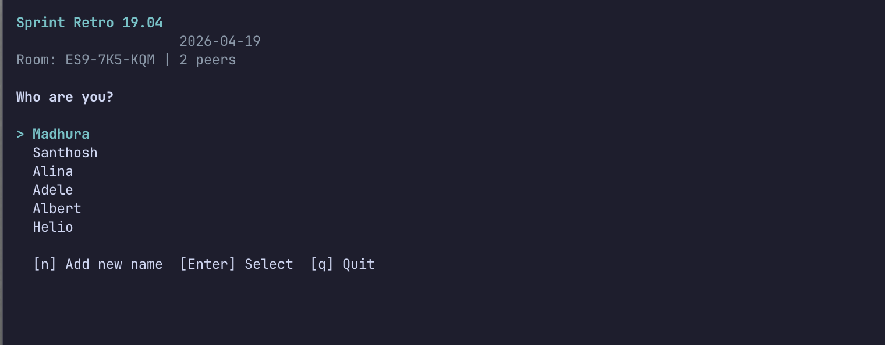
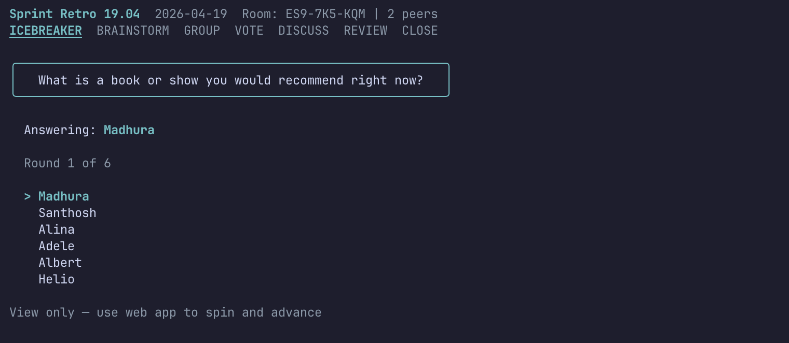
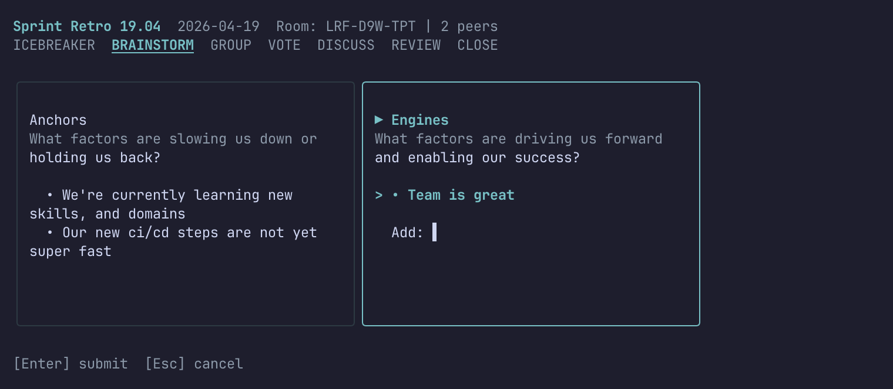
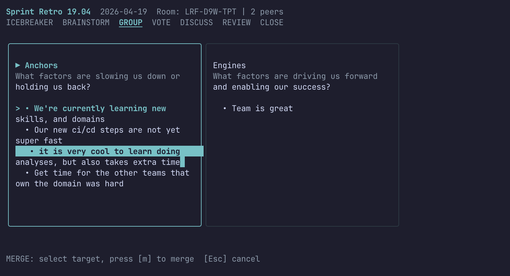
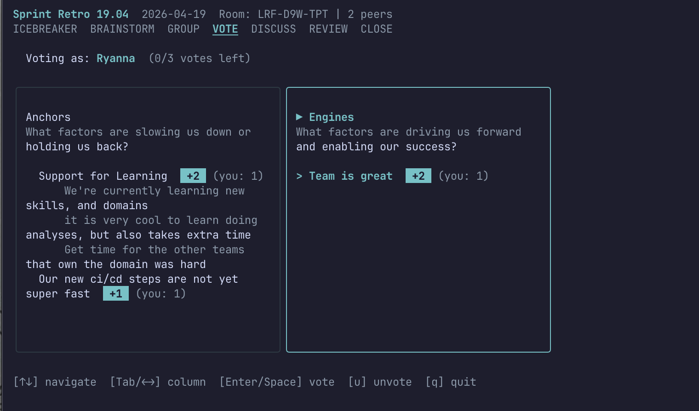
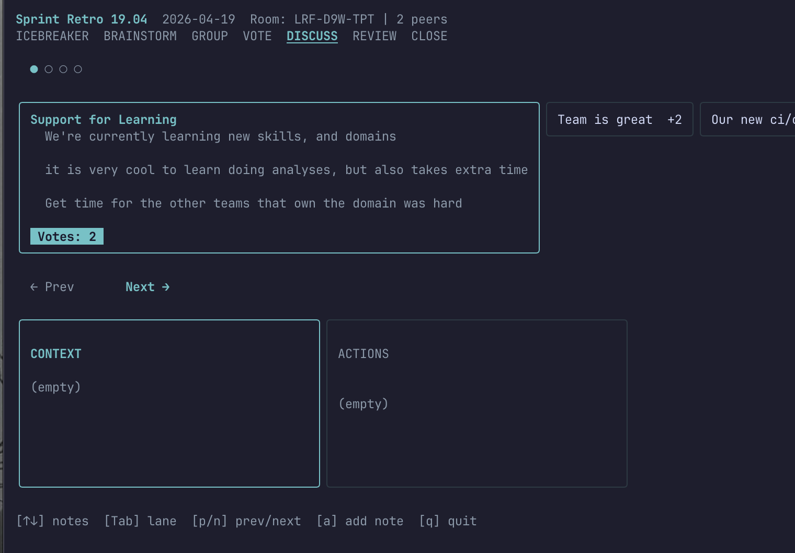

# fastretro-cli

A standalone terminal tool for sprint retrospectives. Manage teams, track action items, run retros locally, or join remote [fastRetro](https://github.com/helmedeiros/fastRetro) sessions — all without leaving your terminal.

Built with [Bubble Tea](https://github.com/charmbracelet/bubbletea) and [Lip Gloss](https://github.com/charmbracelet/lipgloss).

## Quick start

```bash
go install github.com/helmedeiros/fastretro-cli/cmd/fastretro@latest

# Launch the dashboard
fastretro

# Or join a remote session directly
fastretro join "http://localhost:5173/#room=ABC-123-DEF"
```

Or build from source:

```bash
git clone https://github.com/helmedeiros/fastretro-cli.git
cd fastretro-cli
make build
./bin/fastretro
```

## Home Screen

Running `fastretro` with no arguments launches the team dashboard:

```
fastRetro CLI  team: Acme Squad
────────────────────────────────────────────────────────

╭─ MEMBERS (3) ─────╮╭─ AGREEMENTS (2) ──╮╭─ ACTION ITEMS (2) ────────╮
│ > Alice            ││ Demo every Friday ││ [ ] Fix login bug → Bob   │
│   Bob              ││ PRs need 2 reviews││ [x] Update CI → Alice     │
│   Carol            ││                   ││                           │
╰────────────────────╯╰───────────────────╯╰───────────────────────────╯

RETRO HISTORY (1)
────────────────────
  Sprint 42 — 2025-09-07 — 2 action items

[Tab] section  [a] add  [d] delete  [e] edit  [Enter] toggle done
[j] join retro  [n] new retro  [t] teams  [q] quit
```

| Key       | Action                        |
|-----------|-------------------------------|
| `Tab`     | Cycle between panels          |
| `j` / `k` | Navigate within panel         |
| `a`       | Add item (member/agreement/action) |
| `d`       | Delete selected item          |
| `e`       | Edit selected item            |
| `Enter`   | Toggle action item done       |
| `j`       | Join a remote retro session   |
| `n`       | Start a new local retro       |
| `t`       | Open team selector            |
| `q`       | Quit                          |

## Team Management

Press `t` from the home screen to manage teams:

```
Teams
────────────────────────────────────────
> Acme Squad        *
  Backend Crew
  Platform Team

[↑↓] navigate  [Enter] select  [c] create  [d] delete  [r] rename  [Esc] back
```

Or use CLI commands:

```bash
fastretro team list
fastretro team create "Backend Crew"
fastretro team select "Backend Crew"
fastretro team delete "Old Team"
```

Each team has its own members, agreements, action items, and retro history stored locally in `~/.fastretro/`.

## Retro Stages

Every retro follows the same flow. The stage bar at the top always shows where you are:

```
ICEBREAKER  BRAINSTORM  GROUP  VOTE  DISCUSS  REVIEW  CLOSE
```

---

### Join

Pick your identity from the participant list or add a new name.



| Key       | Action                |
|-----------|-----------------------|
| `j` / `k` | Navigate participants |
| `Enter`   | Select identity       |
| `n`       | Add new name          |
| `q`       | Quit                  |

---

### Icebreaker

Watch the icebreaker question and see who's answering. Controlled from the web app.



---

### Brainstorm

Add cards to columns. Navigate between columns with `Tab`. Each column shows its template description so everyone knows what to write about.



| Key              | Action            |
|------------------|-------------------|
| `j` / `k`        | Navigate cards    |
| `Tab` / `l` / `h` | Switch column    |
| `a`              | Add card          |
| `d`              | Delete your card  |
| `Enter`          | Submit card       |
| `Esc`            | Cancel input      |

---

### Group

Merge related cards into clusters. Select a card, press `m`, navigate to the target, press `m` again. Rename groups with `r`, ungroup with `u`.



| Key              | Action             |
|------------------|--------------------|
| `j` / `k`        | Navigate items     |
| `Tab` / `l` / `h` | Switch column     |
| `m`              | Merge (two-step)   |
| `r`              | Rename group       |
| `u`              | Ungroup card       |
| `Esc`            | Cancel merge       |

---

### Vote

Cast votes on cards and groups within your budget. Vote counts and your own votes are shown inline. Groups expand to show their cards for context.



| Key              | Action            |
|------------------|-------------------|
| `j` / `k`        | Navigate items    |
| `Tab` / `l` / `h` | Switch column    |
| `Enter` / `Space` | Cast vote        |
| `u`              | Remove your vote  |

---

### Discuss

Walk through items in the discussion carousel. View context and action notes side by side. Navigate between items with `p`/`n`, switch lanes with `Tab`, and add notes with `a`.



| Key       | Action                    |
|-----------|---------------------------|
| `j` / `k` | Navigate notes            |
| `Tab`     | Switch context/actions     |
| `l` / `h` | Switch context/actions    |
| `p`       | Previous item              |
| `n`       | Next item                  |
| `a`       | Add note to active lane    |

---

### Review

Browse action items and assign owners. The board overview shows all columns side by side.

| Key       | Action          |
|-----------|-----------------|
| `j` / `k` | Navigate items  |
| `o`       | Assign owner    |

---

### Close

View the retro summary: stats, action items with owners, and a full board overview.

---

## Supported templates

The CLI supports all 6 facilitation templates, each with proper column titles and descriptions:

| Template         | Columns                                    |
|------------------|--------------------------------------------|
| Start / Stop     | Stop, Start                                |
| Anchors & Engines | Anchors, Engines                          |
| Mad Sad Glad     | Mad, Sad, Glad                             |
| Four Ls          | Liked, Learned, Lacked, Longed for         |
| KALM             | Keep, Add, Less, More                      |
| Starfish         | Start, More of, Continue, Less of, Stop    |

## How it works

### Standalone mode

Press `n` from the home screen to start a retro locally. Pick a template, name your retro, and go. Team members are pre-loaded as participants. When the retro ends, action items are saved to the team's history.

### Remote mode

Press `j` to join a remote session hosted by the [fastRetro web app](https://github.com/helmedeiros/fastRetro). The CLI connects via WebSocket — changes sync in real time.

```
Browser (host)  <--- WebSocket --->  Vite dev server  <--- WebSocket --->  CLI (participant)
```

When you leave a remote session, participants are automatically added to your team and action items are saved to history.

## Usage

```bash
# Launch dashboard (manage teams, start retros)
fastretro

# Join a remote session by room code
fastretro join ABC-123-DEF

# Join by URL (paste from browser)
fastretro join "http://localhost:5173/#room=ABC-123-DEF"

# Custom server
fastretro join ABC-123-DEF --server https://retro.example.com

# Team management
fastretro team list
fastretro team create "My Team"
fastretro team select "My Team"
```

## Development

```bash
make build      # Build binary to ./bin/fastretro
make test       # Run all tests
make cover      # Coverage report (93%+)
make lint       # Go vet
make cover-html # Open coverage in browser
```

### Project structure

```
cmd/fastretro/        CLI entry point (cobra commands)
internal/
  domain/             Team, history, registry (pure functions, no I/O)
  storage/            JSON file persistence (~/.fastretro/)
  protocol/           WebSocket message types + facilitation templates
  client/             WebSocket connection manager
  tui/                Bubble Tea views (home, shell, retro stages)
  styles/             Lip Gloss dark theme
```

### Data storage

```
~/.fastretro/
  config.json                  Selected team ID
  teams/
    registry.json              Team list [{id, name, createdAt}]
    <team-id>/
      team.json                Members + agreements
      history.json             Completed retros + action items
```

### Test pyramid

| Layer      | Focus                                      | Coverage |
|------------|--------------------------------------------|----------|
| Protocol   | JSON serialization, templates              | 100%     |
| Domain     | Team, history, registry pure functions     | 99%      |
| Client     | Room codes, WebSocket integration          | 88%      |
| Storage    | JSON file persistence                      | 86%      |
| TUI        | Views, key handlers, state mutations       | 91%      |
| **Total**  |                                            | **91%**  |

## Requirements

- Go 1.21+
- A running [fastRetro](https://github.com/helmedeiros/fastRetro) instance

## License

MIT
